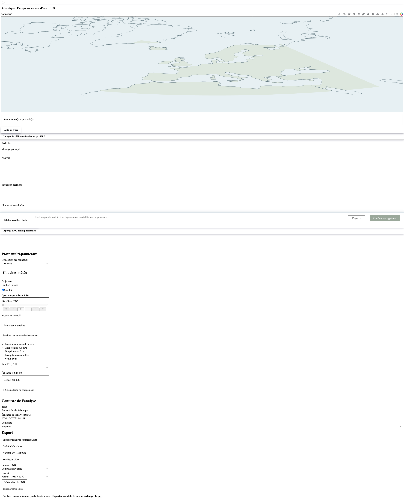
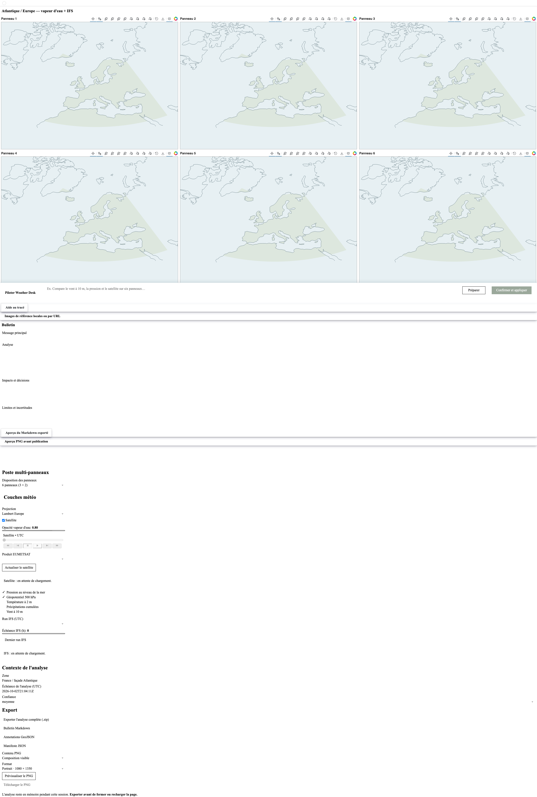

# Évaluation cartographique de l’issue #15

## Résultat

Shapely 2.1.2 découpe les polygones Natural Earth à l’emprise géographique avant leur projection. Les arêtes sont densifiées tous les 0,25° afin que les limites du domaine restent courbes après reprojection. Les tests vérifient la présence du littoral nord-africain, l’absence de grands segments artificiels et l’alignement d’un repère connu en Mercator, Lambert et stéréopolaire.

La sélection du frame satellite est reconstruite avec les buffers après un changement de projection. Un test latest-first puis historique vérifie que l’heure sélectionnée correspond toujours aux pixels affichés.

## Prototype Rasterio

Le prototype `warp_rgba_rasterio` dépaquette chaque pixel RGBA en quatre bandes, déclare explicitement CRS, transformation affine et alpha, puis reconstruit le format attendu par Bokeh. Il reste dans le groupe de dépendances `dev` et n’est pas utilisé par l’application.

Mesure locale sur Mac ARM64, Python 3.12.13, Rasterio 1.5.2, GDAL 3.12.2 et PROJ 9.8.1. Durée totale d’un lot de six images 900×840, une mesure par projection :

| Projection | Warp NumPy actuel | Prototype Rasterio |
|---|---:|---:|
| Mercator | 0,02 s | 0,11 s |
| Lambert Europe | 0,12 s | 0,67 s |
| Stéréopolaire nord | 0,20 s | 0,78 s |

Sur les pixels valides communs, l’écart moyen de couleur RGB entre les deux méthodes est inférieur à 0,7 sur 255. Le warp actuel est nettement plus rapide; il reste donc le chemin d’exécution. Cette mesure synthétique ne constitue pas un benchmark de charge ni une validation sur des images satellite variables.

`uv.lock` contient les wheels macOS ARM64 et Linux ARM64 de Rasterio. Le wheel macOS fonctionne. La construction et l’exécution de l’image Linux ARM64 restent à vérifier : aucun daemon Docker n’était disponible sur l’hôte pendant cette recette.

## Captures

Captures Chromium de l’interface à un viewport de 2560×1440, en Lambert, avec un et six panneaux. Les flux météo n’ont pas été démarrés; elles montrent le fond, les contours côtiers et la disposition des panneaux, pas des données météo en direct.

